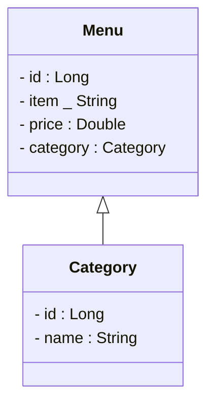

# spring-boot-cafe

## stage-01-spec

### Specifications
Implement the entities for a menu.  

### Tasks
- change the *application.properties* to *application.yml* and configure the port to **8888** and the service context to **/api**
- Start the service and check, if category endpoints are available
- Implement the entity, service, controller for the menu according to the category
- Implement an additional funktionality **getByCategory** to the service and controller
- Import the prepared request collection for postman () and adapt it for the **menu** endpoints

### Goals
- Service Endpoints are available and return a 200 and a response body
